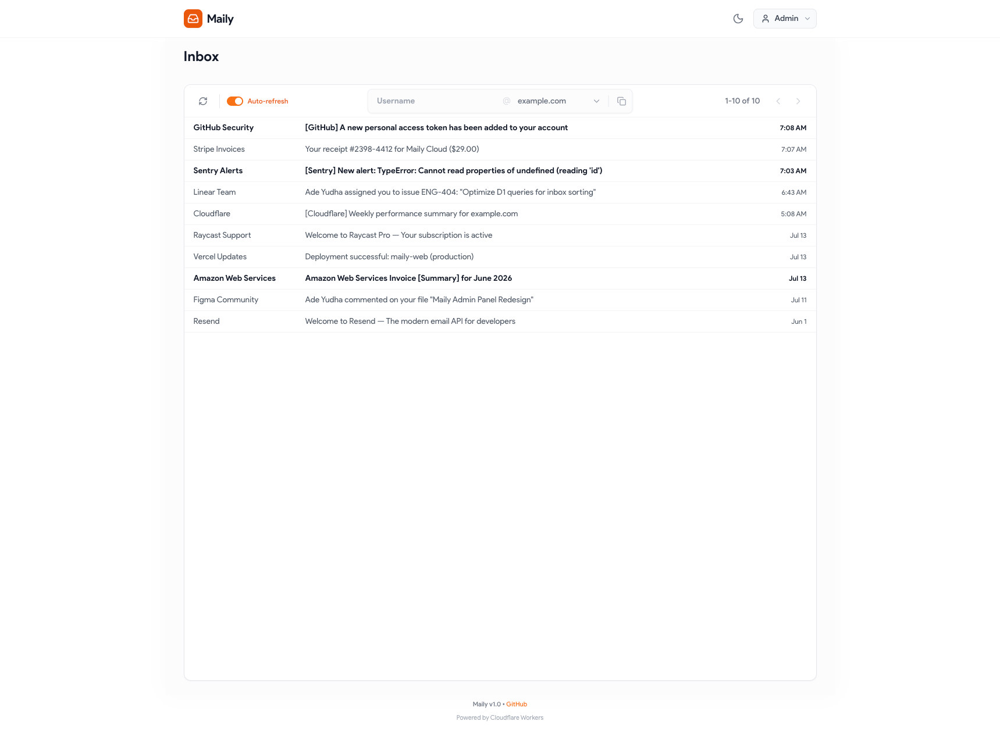

# Maily

A self-hosted disposable email service built on Cloudflare Workers, D1, and React. Catch-all inboxes for any domain you control, with a clean admin panel to manage domains, read incoming mail, and rotate credentials.



## Features

- **Multi-domain catch-all** — add any domain you own; emails to `anything@yourdomain.com` are captured
- **Web admin panel** — login, browse the inbox, search, sort, paginate
- **Domain management** — add/remove domains, drag-and-drop reorder
- **Auto-refresh** — inbox polls every 5s when enabled
- **HTML email rendering** — sanitized with DOMPurify before display
- **Dark mode** — persisted in `localStorage`, respects system preference on first load
- **Password change** — change the admin password from the settings page
- **Cloudflare-native** — runs entirely on the edge, no separate API server

## Tech stack

| Layer | Stack |
|---|---|
| Runtime | Cloudflare Workers (Node.js compat) |
| API | Hono |
| Database | Cloudflare D1 (SQLite) |
| Frontend | React 19 + Vite + TypeScript |
| Styling | Tailwind CSS 3 |
| Data fetching | TanStack Query |
| Email parsing | postal-mime |
| Drag-and-drop | dnd-kit |
| Icons | lucide-react |

## Architecture

```
maily/
├── apps/
│   ├── api/                    Cloudflare Worker (Hono)
│   │   ├── src/
│   │   │   ├── app.ts          Hono app factory (routes + SPA fallback)
│   │   │   ├── index.ts        Worker entry (fetch + email handler)
│   │   │   ├── env.ts          Env types
│   │   │   ├── middleware/     requireAuth
│   │   │   ├── routes/         auth, domains, emails
│   │   │   ├── repositories/   users, domains, emails (D1 queries)
│   │   │   ├── services/       inbound-email handler
│   │   │   └── lib/crypto.ts   Password hashing (PBKDF2-SHA256)
│   │   └── schema.sql          D1 schema
│   └── web/                    React + Vite SPA
│       ├── src/
│       │   ├── App.tsx         Layout + router
│       │   ├── pages/          Inbox, EmailDetail, Settings
│       │   ├── components/     Header, UserMenu, LoginForm, EmailSelector, ...
│       │   ├── hooks/          useDarkMode, useClickOutside, useCurrentUser
│       │   ├── lib/            api.ts (typed API client), query-keys.ts
│       │   ├── types.ts        Shared types (Email, Domain, ApiError)
│       │   └── utils/          timeAgo
│       └── public/             favicon
├── wrangler.toml               Cloudflare Worker config
├── tsconfig.json               Shared base config
├── package.json                Single package, no workspaces
└── schema.sql                  (also at apps/api/schema.sql)
```

The frontend is built into `dist/` and served by the Worker as static assets, with SPA fallback to `index.html` for non-API routes.

## Prerequisites

- **Node.js 20+** (tested on v24)
- **npm 10+**
- A Cloudflare account with Workers and D1 enabled
- One or more domains whose MX records point to Cloudflare's email routing (so inbound mail reaches the Worker)

## Getting started

### 1. Install

```bash
npm install
```

### 2. Initialize the local D1 database

```bash
npx wrangler d1 execute maily-db --local --file=apps/api/schema.sql
```

The schema creates three tables (`users`, `domains`, `emails`) and seeds a single admin user.

**⚠️ The default admin password is `123456`** — change it right after your first successful login via **Settings → Security**. The hash is in `apps/api/schema.sql` if you want to set a different default before first run.

### 3. Run the dev servers

In one terminal, start the API (wrangler dev on `:8787`):

```bash
npm run dev:api
```

In a second terminal, start the UI (Vite on `:5173`):

```bash
npm run dev:ui
```

Open <http://localhost:5173>. Vite proxies `/api/*` requests to the wrangler dev server.

## Scripts

| Script | Description |
|---|---|
| `npm run dev:api` | Start wrangler dev (Cloudflare Workers local runtime) on `:8787` |
| `npm run dev:ui` | Start Vite dev server on `:5173` with `/api` proxy to `:8787` |
| `npm run build` | Build the React app into `dist/` |
| `npm run deploy:api` | Deploy the Worker + static assets to Cloudflare |

## Database

Three tables, defined in `apps/api/schema.sql`:

- **`users`** — single-table admin auth (`username`, `password_hash`)
- **`domains`** — managed catch-all domains (`name`, `sort_order`)
- **`emails`** — captured messages (`to`, `from`, `subject`, `body_text`, `body_html`, `received_at`, `is_read`)

The local D1 lives in `apps/api/.wrangler/state/v3/d1/`. The remote D1 binding is configured in `wrangler.toml`.

### Local D1 commands

```bash
# Apply schema
npx wrangler d1 execute maily-db --local --file=apps/api/schema.sql

# Run an ad-hoc query
npx wrangler d1 execute maily-db --local --command="SELECT * FROM users;"

# Target the remote D1 instead
npx wrangler d1 execute maily-db --remote --command="..."
```

## Configuration

`wrangler.toml` (project root) controls the Worker:

```toml
name = "maily"
main = "apps/api/src/index.ts"
compatibility_date = "2024-04-05"
compatibility_flags = ["nodejs_compat"]

[assets]
directory = "./dist"
binding = "ASSETS"
not_found_handling = "single-page-application"

[[d1_databases]]
binding = "DB"
database_name = "maily-db"
database_id = "<your-d1-database-id>"
```

To deploy against your own Cloudflare account:
1. Rename `wrangler.toml.example` to `wrangler.toml` in the project root.
2. Run `npx wrangler d1 create maily-db` to provision a fresh D1 database.
3. Replace the `database_id` placeholder in your `wrangler.toml` with the ID provided by the previous command.
4. You can also change the worker `name` if you want a different URL.

## Deployment

```bash
npm run build           # produces ./dist
npm run deploy:api      # uploads the Worker + assets
```

The `deploy:api` step uploads both the worker script (compiled from `apps/api/src/index.ts`) and the static assets in `dist/`. The Worker is accessible at `https://<name>.<subdomain>.workers.dev`.

The D1 schema is **not** migrated automatically. To apply schema changes to production:

```bash
npx wrangler d1 execute maily-db --remote --file=apps/api/schema.sql
```

## Security notes

- Passwords are hashed with **PBKDF2-HMAC-SHA256, 100,000 iterations** (see `apps/api/src/lib/crypto.ts`). No salt reuse — each password gets a fresh 16-byte random salt.
- Sessions are cookie-based (`session_user`, `httpOnly`, same-site implied by browser defaults). There's no expiration; logging out clears the cookie.
- Inbound HTML is sanitized with **DOMPurify** before being injected via `dangerouslySetInnerHTML` (see `apps/web/src/pages/EmailDetail.tsx`).
- The default admin user has a placeholder password hash. Change it before exposing the deployment to anyone else.

## API reference

| Method | Path | Auth | Description |
|---|---|---|---|
| `GET` | `/api/health` | – | Liveness check |
| `POST` | `/api/auth/login` | – | Login, sets `session_user` cookie |
| `GET` | `/api/auth/me` | – | Returns current user (or 401) |
| `POST` | `/api/auth/logout` | – | Clears the session cookie |
| `POST` | `/api/auth/change-password` | ✓ | Change the admin password |
| `GET` | `/api/domains` | ✓ | List domains, sorted by `sort_order` |
| `POST` | `/api/domains` | ✓ | Add a domain |
| `PUT` | `/api/domains/reorder` | ✓ | Reorder domains (`{ domainIds: string[] }`) |
| `DELETE` | `/api/domains/:id` | ✓ | Remove a domain |
| `GET` | `/api/emails?to=&page=&limit=` | ✓ | Paginated inbox |
| `GET` | `/api/emails/:id` | ✓ | Fetch one email (marks as read) |
| `DELETE` | `/api/emails/:id` | ✓ | Delete an email |

The Worker also exports an `email` handler that catches inbound mail via Cloudflare Email Routing, parses it with `postal-mime`, and inserts a row into `emails`.
